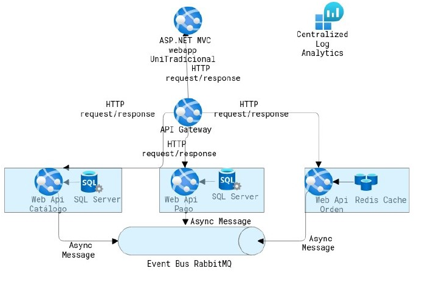

# Arquitectura del proyecto

La Tienda utiliza una arquitectura basada en ASP.NET Core microservicios. Las solicitudes HTTP de los clientes a la aplicación web de la tienda para que puedan acceder a los microservicios se enrutan a través de una puerta de enlace API, que es una implementación de Backens-For-Frontends. Las puertas de enlace API mejoran la seguridad y desacoplan los servicios backend de los clientes individuales. 

Las piezas de funcionalidad como parte de la aplicación son:

- Catálogo de eventos
- Carrito de compra
- Servicio de pago

Cada una de las características anteriores se administra con un microservicio distinto. Cada microservicio es autónomo, se puede implementar de forma independiente y es responsable de sus propios datos.

Esta arquitectura permite que cada microservicio implemente el almacén de datos que esté mejor optimizado para su carga de trabajo, necesidades de almacenamiento y patrones de lectura-escritura. Las opciones de almacenamiento de datos incluyen relacional y clave-valor.
El servicio de catálogo al igual que el servicio de pago, almacenan sus datos en una base de datos SQL Server. El servicio de carrito de compra utiliza una cache de Redis para almacenamiento. No existe un único almacén de datos con el que interactúen todos los servicios. En cambio, la comunicación entre servicios se produce según sea necesario, ya sea a través de llamadas API de forma asíncrona y a través de mensajería. Este aislamiento de datos le da a cada servicio la autonomía para aplicar de forma independiente las actualizaciones del esquema de datos, sin romper otros servicios en el entorno de producción.
También, utiliza un bus de eventos para mensajería asincrónica y comunicación basada en eventos, empleando para ello, el patrón de publicación / suscripción (comúnmente abreviado como pub-sub) que se usa con el bus de eventos. Cualquier servicio puede publicar un evento en el bus de eventos. Cada servicio es responsable de suscribirse a los mensajes relevantes para su dominio. 

A continuación, el diagrama de arquitectura empleado:

También existen requerimientos no funcionales para esta aplicación que justifican la elección de esta arquitectura basada en microservicios:

- Escalabilidad flexible: Los eventos se van ordenando en el catálogo de servicios conforme se esté acercando la fecha de celebración, ciertos combos de disfraces son enormemente demandados, especialmente durante estas fechas. Esta es la razón por la cual UniTradicional necesita poder ser escalada de forma flexible.
Además, no se quiere pagar por recursos de cómputo en un día lento, pero se necesita alta disponibilidad en en día ocupado y una parte de la aplicación que recibe la carga alta debería poder se escalada cuando sea necesario.
- Implementación de entrega continua de forma independiente, equipos separados y fácil de expandir: Cada parte de la aplicación debería poder ser implementada de forma independiente del resto de las partes usando despliegue continuo. Una de las razones es que cada parte pueda ser separada en equipos con diferentes localizaciones trabajando cada parte a su medida. Debe proporcionar la facilidad para añadir funcionalidades nuevas.
- De confianza: Es una aplicación debe generar confianza y motivación a los clientes. Se busca la felicidad en los clientes. Por tanto, cuando accedan a la compra de algún combo de disfraz debe de haber la menos posibilidad de perder alguna información

