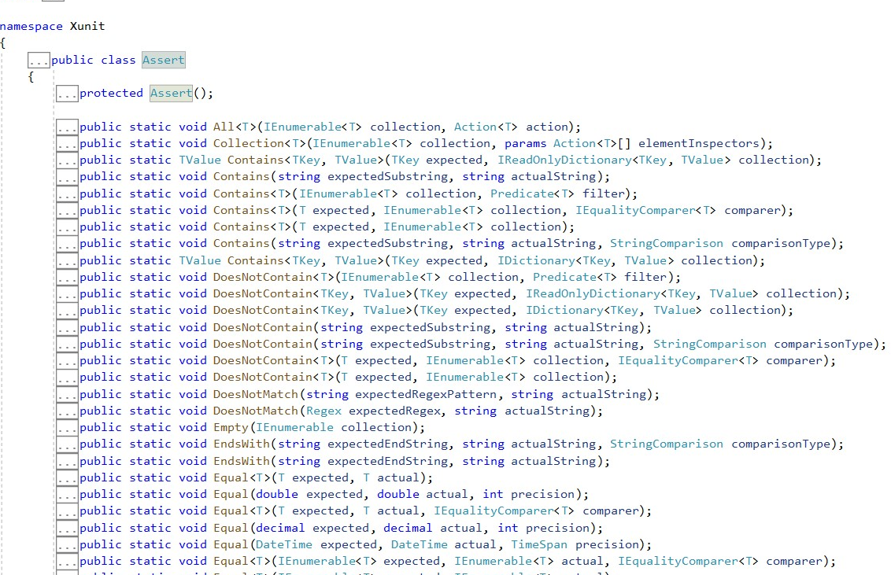
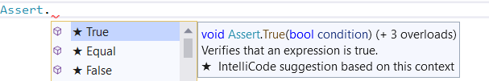

# Biblioteca de Aserciones Usada

El marco de prueba xUnit emplea la API Assert como biblioteca de aserciones y esta es la que yo utilizo en mi proyecto. Y sí, comienzo nombrando el marco de prueba xUnit pues fue el que elegí para la realización de mis test unitarios. Tú puedes ver la justificación de mi elección [aquí](https://github.com/ccvaillant1992/UniTradicional/blob/master/docs/MarcodePruebaUsado.md)
xUnit, cuando carga el proyecto de prueba para poder encontrar las pruebas dentro de la solución y ejecutarlas, busca métodos que tengan este atributo [Fact]. Y para decir que pasó y qué falló emplea la API proporcionada por la clase llamada Assert que se encuentra en dicho namespace xUnit. Puedes verlo abajo en la captura.

Como puedes apreciar, la captura anterior muestra los diferentes métodos que me proporciona esta librería de aserción, y me posibilita la realización de mis test. Abajo puedes observar el método que empleé en la realización de mis test unitarios.

También quiero mencionarte el estilo que elegí para la realización de mis test. Este es Test Driven Development (TDD). Con este, escribo la prueba unitaria antes del código que quiero verificar. Este estilo está destinado a ayudar a escribir el código de manera más simple, legible y eficiente. Estableciendo que debo comenzar escribiendo una prueba unitaria fallida, luego, escribir el código de producción y posteriormente refactorizar en caso de que sea necesario. Con el empleo de este estilo apoyado de la librería de aserciones mencionada anteriormente aumenta mi confianza cuando desarrollo el código de mi proyecto. Se que la posibilidad de fallos que presentaré será cada vez menor.)
