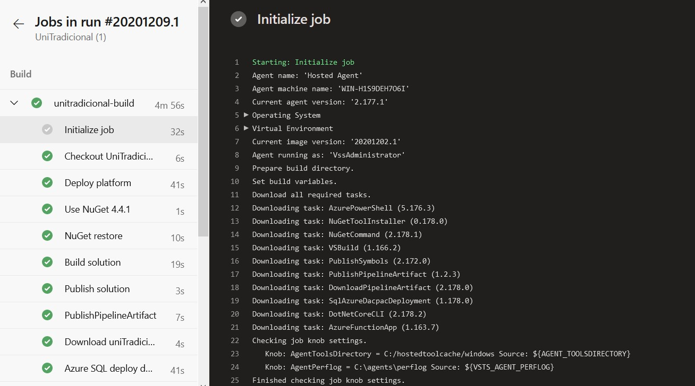
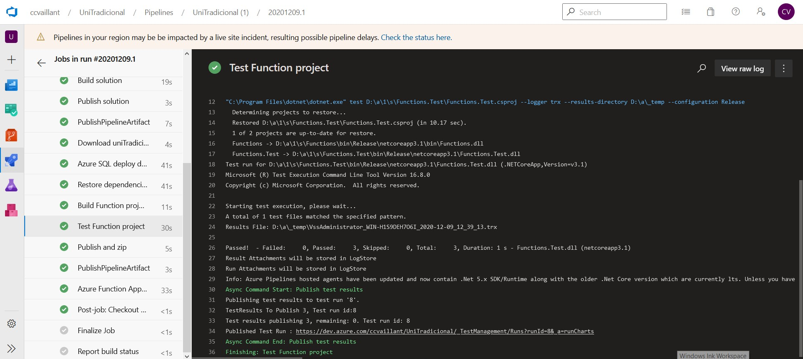

Por gestor de tareas entiendo una herramienta que me permita automatizar las tareas que quiero realizar. Entonces, para la realización de mi proyecto, como gestor de tareas he empleado Azure Pipelines. Este constituye un servicio en la nube de Azure, que lo puedo usar para compilar y probar automáticamente mi proyecto a través de tareas definidas. Además, Azure Pipelines combina la integración continua (CI) y la entrega continua (CD) del código de manera constante y uniforme. 

He usado para el despliegue automático de tareas mediante la sintaxis YAML el siguiente [pipeline](https://github.com/ccvaillant1992/UniTradicional/blob/master/TaskManager.yml) que despliega las tareas especificadas hasta ahora ``` dotnet restore, build, test, publish ``` para el caso del código del microservicio), apoyandose en este [script](https://github.com/ccvaillant1992/UniTradicional/blob/master/deployResources.ps1) de power shell que a su vez, emplea la [template](https://github.com/ccvaillant1992/UniTradicional/blob/master/resources.json) definida para cada recurso y sus propiedades específicas.

Ahora quiero mostrarte capturas de pantalla de la ejecución del pipeline en Azure DevOps



Ejemplo de la ejecución automática de la tarea que me permite realizar los test unitarios que tengo definidos a mi solución:




