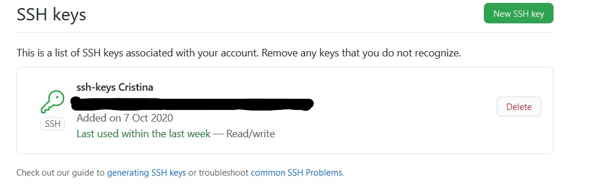

# Preparación inicial del entorno de trabajo  

Este documento abarca los pasos seguidos para la preparación del entorno de trabajo con las herramientas git y github, con el objetivo de usar el repositorio de forma correcta para el desarrollo del proyecto dela asignatura Cloud Computing.


## Creación de los repositorios

- [Fork del Repositorio de Cloud Computing 20-21](https://github.com/ccvaillant1992/CC-20-21): Fork realizado al repositorio de la asignatura de Cloud Computing a mi cuenta de github  
- [Repositorio del Proyecto](https://github.com/ccvaillant1992/CC-20-21-Proyecto): Muestra el avance del proyecto para el despliegue de la aplicación a desarrollar en diferentes hitos  
- [Repositorio de Ejercicios](https://github.com/ccvaillant1992/CC-20-21-Ejercicios): Repositorio de los ejercicios orientados por tema en la asignatura Cloud Computing 

## Creación de claves y subida de clave pública a GitHub

Generar una nueva clave SSH para usar para la autenticación y luego agregarla al ssh-agent.


Para usar la clave SSH nueva generada, también agregar a la cuenta de GitHub.



## Configuración de nombre y correo electrónico para que apareza en los commits

```
$ git config --global user.name "Cristina"
$ git config --global user.email cristinac.vaillant@example.com

$ git config --list

user.name=Cristina
user.email=cristinac.vaillant@gmail.com

```

## Activar el segundo factor de autenticación

Habilitar la autenticación de dos factores (2FA) como capa adicional de seguridad que se utiliza al iniciar sesión en sitios web o aplicaciones. 
Como segunda forma de autenticación para GitHub, enviar un código como mensaje de texto (SMS). 


## Configuración de los remotos

Mantener la copia actualizada con el repositorio original. Para ello, definir un repositorio *upstream* de

```
$ git remote add upstream https://github.com/JJ/CC-20-21.git

```

y antes de trabajar con el *fork* local del repositorio hacer

```
$ git pull upstream master --rebase

```
Listar las conexiones remotas configuradas de otros repositorios.

```

$ git remote -v

```
