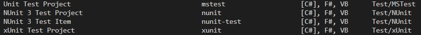
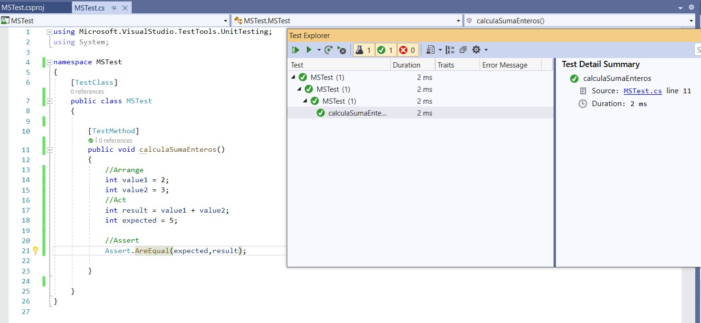
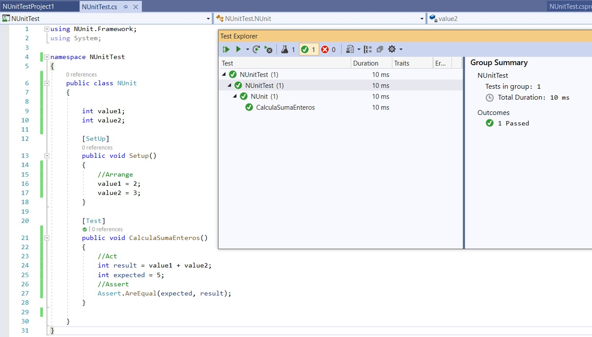
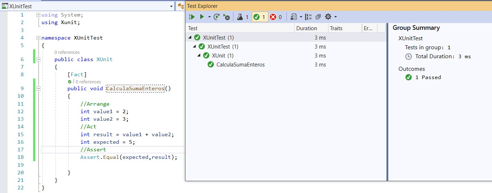

## Marco de pruebas usado

Con el objetivo de probar las funcionalidades de mi código y verificar que se comportan correctamente según lo esperado, es necesario escribir test unitarios. Cada unidad de dichos test, constituirá el código que quiero probar y esta unidad debe ser lo más pequeña posible. Los test unitarios son automáticos, y los puedo realizar a través de un marco de prueba, que el empleo del framework .NET en mi proyecto me permite ejecutar estos test empleando para ello, el comando ```dotnet test ```. De esta forma, la ejecución en primer lugar me encuentra los test unitarios que he escrito, posteriormente ejecuta cada uno de ellos y finalmente me brinda un reporte mostrando si los test pasaron la prueba o no. 

Abajo, una captura de cuando ejecuto el comando ```dotnet test``` en mi IDE Visual Studio Code y puedes apreciar las diferentes plantillas de proyecto para cada marco de prueba.




Además, empleando C# con el framework .NET en mi proyecto, puedo decidir qué marco de prueba utilizar para realizar los test unitarios y entre los más utilizados y nombrados (xUnit, MSTest y NUnit). Por tanto, para justificar mi elección, he realizado una comparación entre los mismos, apoyándome en la creación de un proyecto de prueba para cada uno de ellos, utilizando como IDE Visual Studio.

- Es un proyecto sencillo, quiero realizar un cálculo (suma) y luego verificar que el resultado de mi cálculo es igual al esperado. Puedes ver capturas de pantalla posteriormente.

MSTest



NUnit



xUnit



Ahora una comparación básica con los 3 marcos de prueba vistos anteriormente

|Criterio |MSTest |NUnit |xUniT|Comentarios|
|Atributos que emplea para marcar el método de prueba|[TestMethod]|[Test]|[Fact]|-|
|API para probar el método |Assert.AreEqual|Assert.AreEqual|Assert.Equal|Misma API para probar el método implementado, varía el método empleado por la clase Assert.|
|Constructor|-|[SetUp]|-|NUnit define de manera predeterminada un constructor, en los restantes marcos los pudiera definir, pero no es obligatorio.|
|Convención empleada para la organización y entendimiento del test|//Arrange //Act //Assert|//Arrange //Act //Assert|//Arrange //Act //Assert|Como buena practica puedo dividir en 3 secciones el test. 
//1era sección reúno todos mis datos de prueba  //2da sección invoco un método para la realización del cálculo que me va a producir un resultado en este caso //3era Afirmo sobre el valor del cálculo planteado en la sección anterior.|

En el cuadro comparativo te mencioné una de las convenciones empleadas como buena práctica cuando se realiza un test unitario, pero quiero mencionarte también que usando el lenguaje c# en .Net y estoy segura que con otros lenguajes también, otra de las convenciones es escribir los test unitarios en proyectos separados del código de producción. En mi solución se puede apreciar el proyecto [Functions] que contiene el código del microservicio desarrollado hasta ahora Catálogo y el proyecto [Functions.Test] dedicado a los tests unitarios realizados hasta el momento.

Bueno, la comparación anterior como mencioné anteriormente, es sencilla, en realidad no tengo mucha experiencia en el trabajo con marcos de prueba que me provea un argumento más fuerte para decidirme por uno u otro. Pero por lo visto y aprendido hasta el momento, me he sentido más cómoda con el empleo de xUnit por su diseño de extrema simplicidad. Además de ser una herramienta de prueba unitaria gratuita y de código abierto, por tanto, fue el que decidí emplear en la realización de mi proyecto como marco de prueba para mis test unitarios.

